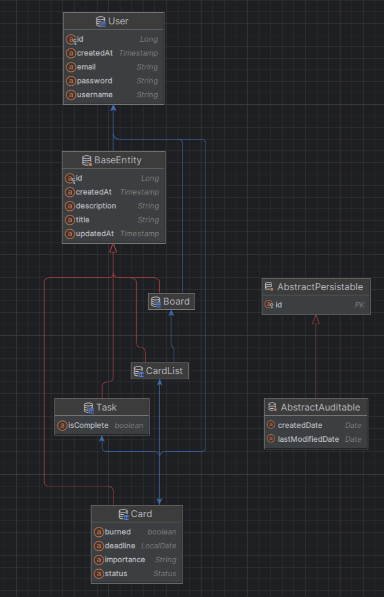

## ERD

## Описание
Реализован Task Manager - аналог сервиса trello.

1) Возможность создавать пользователя и аутентифицироваться с помощью JWT token
2) CRUD Досок (Board). 
* Для досок могут назначаться модераторы(поле moderators) и сотрудники (поле members). 
* Сотрудники могут выполнять только операцию чтения, модераторы могут выполнять все операции
3) CRUD Листов (CardList). 
* Листы могут создавать, изменять, удалять только модераторы конкретной доски, а сотрудники конкретной доски только читать
4) CRUD Карт (Card). 

* Карты может создавать, изменять, удалять только модератор конкретной доски, а сотрудники конкретной доски только читать.
* Для карты могут быть назначены исполнители (assignees). При создании новой карты ей автоматически присваивается статус NEW.
* Как только хоть одна задача в карте выполнена карта переходит в статус DOING.
* Возможность назначить deadline для карты.  
Реализован шедулер, который в 00:01 каждого дня (в ненагруженное время) проверяет поле isComplete каждой задачи, 
если хоть одна задача не выполнена (false) - карте присваивается статус burned.
* Реализован эндпоинт для поиска просроченных карт

5) CRUD Задач (Task).

* Задачи может создавать и удалять только модератор конкретной доски. Изменять (эндпоинт complete) может только исполнитель карты (assignee)

Примечания:
* Посмотреть url ручек можно в swagger по url по умолчанию: http://localhost:8080/swagger-ui/index.html
* Также в корне приложет файл для postman, который легко импортировать
* Каждый url контроллируется с помощью аспектов:  
Пример: Если пользователь suhoi создал boards/1/card-list/1, а пользователь baton создал boards/2/card-list/2, то пользователь suhoi не сможет получить доступ
к url boards/2/card-list/2.  
И это лишь пример. Абсолютно каждый путь, каждый @PathVariable проверяется через аспект по аннотации на принадлежность к конкретной доске (members of Board)

* Также реализован замер выполнение методов через аспекты по аннотации.
* Аудит вынесен в отдельный микросервис и сохраняет действия пользователя в БД ClickHouse

## Деплой
1) docker-compose.yml up -d
2) Запустить оба сервиса

Файл постмана находится в корне проекта

## Используемые технологии
* Java 17
* Gradle 8.7
* Spring Framework (Boot, Web, Data JPA, Security, Scheduler, AOP)
* Liquibase
* Kafka
* OpenApi
* Docker
* Mockito, JUnit5, Testcontainers
* Sonarqube
## Базы данных
* PostgreSQL
* ClickHouse